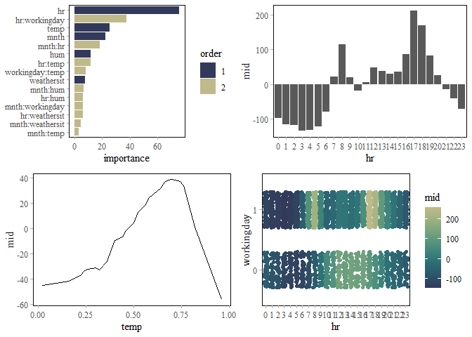
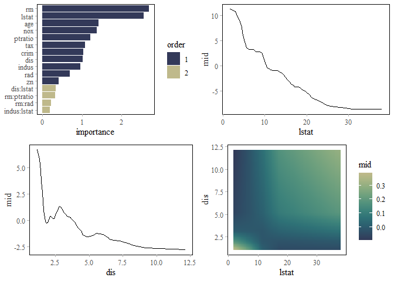

<!-- README.md is generated from README.Rmd. Please edit that file -->

# midnight 

<!-- badges: start -->

<!-- badges: end -->

The ‘midnight’ package implements a ‘parsnip’ engine for the ‘midr’
package, allowing users to seamlessly fit, tune, and evaluate MID
(Maximum Interpretation Decomposition) models with ‘tidymodels’
workflows. Development and augmentation of the package are driven by
research from the “Moonlight Seminar 2025”, a collaborative study group
of actuaries from the Institute of Actuaries of Japan focused on
advancing the practical applications of interpretable models.

## Installation

You can install the development version of midnight from
[GitHub](https://github.com/) with:

``` r
# install.packages("pak")
pak::pak("ryo-asashi/midnight")
```

## Fit MID Surrogate Models using ‘parsnip’

This is a basic example which shows you how to solve a common problem:

``` r
library(parsnip)
library(midr)
library(midnight)
library(ggplot2)
library(gridExtra)
library(tune)
library(rsample)
theme_set(theme_midr("y"))
```

``` r
# create a first-order mid surrogate model
mid_spec_1 <- mid_surrogate(
  params_main = 50, penalty = .9
) %>%
  set_mode("regression") %>%
  set_engine("midr", verbosity = 3)
mid_spec_1
#> mid surrogate Model Specification (regression)
#> 
#> Main Arguments:
#>   penalty = 0.9
#>   params_main = 50
#> 
#> Engine-Specific Arguments:
#>   verbosity = 3
#> 
#> Computational engine: midr
# fit the model
mid_1 <- mid_spec_1 %>%
  fit(Ozone ~ ., airquality)
mid_1
#> parsnip model object
#> 
#> 
#> Call:
#> interpret(x = x, y = y, weights = weights, k = k, lambda = penalty,
#>  verbosity = ..1)
#> 
#> Intercept: 42.099
#> 
#> Main Effects:
#> 5 main effect terms
#> 
#> Uninterpreted Variation Ratio: 0.085045
```

``` r
# create a second-order mid surrogate model via "custom formula"
mid_spec_2 <- mid_surrogate(
  params_main = 50, params_inter = 5, penalty = .9,
  custom_formula = Ozone ~ .^2
) %>%
  set_mode("regression") %>%
  set_engine("midr", verbosity = 3)
mid_spec_2
#> mid surrogate Model Specification (regression)
#> 
#> Main Arguments:
#>   penalty = 0.9
#>   params_main = 50
#>   params_inter = 5
#>   custom_formula = Ozone ~ .^2
#> 
#> Engine-Specific Arguments:
#>   verbosity = 3
#> 
#> Computational engine: midr
# fit the model
mid_2 <- mid_spec_2 %>%
  fit(Ozone ~ ., airquality) # pass original data on to interpret()
mid_2
#> parsnip model object
#> 
#> 
#> Call:
#> interpret(formula = Ozone ~ .^2, data = data, weights = weights,
#>  verbosity = ..1, k = k, lambda = penalty)
#> 
#> Intercept: 42.099
#> 
#> Main Effects:
#> 5 main effect terms
#> 
#> Interactions:
#> 10 interaction terms
#> 
#> Uninterpreted Variation Ratio: 0.073086
```

``` r
grid.arrange(nrow = 2,
 ggmid(mid.importance(mid_2$fit), theme = "moon"),
 ggmid(mid_2$fit, "Temp", main.effects = TRUE),
 ggmid(mid_2$fit, "Wind", main.effects = TRUE),
 ggmid(mid_2$fit, "Temp:Wind", main.effects = TRUE, theme = "moonlit")
)
```



## Tune MID Surrogate Models using ‘tune’

``` r
# create a second-order mid surrogate model via "custom formula"
mid_spec <- mid_surrogate(
  params_main = tune(),
  params_inter = tune(),
  penalty = tune(),
  custom_formula = Ozone ~ .^2
) %>%
  set_mode("regression") %>%
  set_engine("midr", verbosity = 3)
mid_spec
#> mid surrogate Model Specification (regression)
#> 
#> Main Arguments:
#>   penalty = tune()
#>   params_main = tune()
#>   params_inter = tune()
#>   custom_formula = Ozone ~ .^2
#> 
#> Engine-Specific Arguments:
#>   verbosity = 3
#> 
#> Computational engine: midr
# define a cross validation method
set.seed(42)
cv <- vfold_cv(na.omit(airquality), v = 3)
# execute the hyperparameter tuning
tune_res <- mid_spec %>%
  tune_grid(
    Ozone ~ .,
    resamples = cv,
    grid = 100
  )
tune_best <- select_best(tune_res, metric = "rmse")
tune_best
#> # A tibble: 1 × 4
#>   penalty params_main params_inter .config               
#>     <dbl>       <int>        <int> <chr>                 
#> 1    8.70          38            1 Preprocessor1_Model079
```

``` r
# create a second-order mid surrogate model via "custom formula"
mid_spec <- mid_surrogate(
  params_main = tune_best$params_main,
  params_inter = tune_best$params_inter,
  penalty = tune_best$penalty,
  custom_formula = Ozone ~ .^2
) %>%
  set_mode("regression") %>%
  set_engine("midr", verbosity = 3)
mid_spec
#> mid surrogate Model Specification (regression)
#> 
#> Main Arguments:
#>   penalty = tune_best$penalty
#>   params_main = tune_best$params_main
#>   params_inter = tune_best$params_inter
#>   custom_formula = Ozone ~ .^2
#> 
#> Engine-Specific Arguments:
#>   verbosity = 3
#> 
#> Computational engine: midr
# fit the model
mid_tune <- mid_spec %>%
  fit(Ozone ~ ., airquality) # pass original data on to interpret()
mid_tune
#> parsnip model object
#> 
#> 
#> Call:
#> interpret(formula = Ozone ~ .^2, data = data, weights = weights,
#>  verbosity = ..1, k = k, lambda = penalty)
#> 
#> Intercept: 42.099
#> 
#> Main Effects:
#> 5 main effect terms
#> 
#> Interactions:
#> 10 interaction terms
#> 
#> Uninterpreted Variation Ratio: 0.18429
```

``` r
grid.arrange(nrow = 2,
 ggmid(mid.importance(mid_tune$fit), theme = "moon"),
 ggmid(mid_tune$fit, "Temp", main.effects = TRUE),
 ggmid(mid_tune$fit, "Wind", main.effects = TRUE),
 ggmid(mid_tune$fit, "Temp:Wind",
       main.effects = TRUE, theme = "moonlit")
)
```


