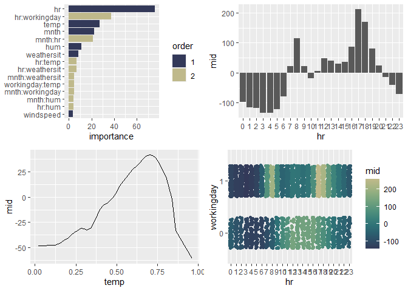

<!-- README.md is generated from README.Rmd. Please edit that file -->

# midnight 

<!-- badges: start -->

<!-- badges: end -->

The ‘midnight’ package implements a ‘parsnip’ engine for the ‘midr’
package, allowing users to seamlessly fit, tune, and evaluate MID
(Maximum Interpretation Decomposition) models with ‘tidymodels’
workflows. Development and augmentation of the package are driven by
research from the “Moonlight Seminar 2025”, a collaborative study group
of actuaries from the Institute of Actuaries of Japan focused on
advancing the practical applications of interpretable models.

## Installation

You can install the development version of midnight from
[GitHub](https://github.com/) with:

``` r
# install.packages("pak")
pak::pak("ryo-asashi/midnight")
```

## Fit MID Surrogate Models using ‘parsnip’

This is a basic example which shows you how to solve a common problem:

``` r
library(tidymodels)
library(midr)
library(midnight)
library(gridExtra)
library(ISLR2)
```

``` r
# split dataset into training / validating subsets
set.seed(42)
usecol <- c("mnth", "hr", "workingday", "weathersit",
            "temp", "hum", "windspeed", "bikers")
all <- ISLR2::Bikeshare |>
  select(all_of(usecol)) |>
  mutate(workingday = as.factor(workingday))
holdout <- initial_split(all, prop = .5)
train <- training(holdout)
valid <- testing(holdout)
```

``` r
# create a first-order mid surrogate model
mid_spec_1 <- mid_reg()
mid_spec_1
#> mid reg Model Specification (regression)
#> 
#> Computational engine: midr
# fit the model
mid_1 <- mid_spec_1 %>%
  fit(bikers ~ ., train)
mid_1
#> parsnip model object
#> 
#> 
#> Call:
#> interpret(formula = bikers ~ ., data = data)
#> 
#> Intercept: 146.06
#> 
#> Main Effects:
#> 7 main effect terms
#> 
#> Uninterpreted Variation Ratio: 0.30041
# evaluate the model
augment(mid_1, new_data = valid) %>%
  rmse(truth = bikers, estimate = .pred)
#> # A tibble: 1 × 3
#>   .metric .estimator .estimate
#>   <chr>   <chr>          <dbl>
#> 1 rmse    standard        72.9
```

``` r
grid.arrange(nrow = 2,
 ggmid(mid.importance(mid_1$fit), theme = "moon", max.nterms = 15),
 ggmid(mid_1$fit, "hr"),
 ggmid(mid_1$fit, "temp"),
 ggmid(mid_1$fit, "mnth")
)
```


``` r
# create a second-order mid surrogate model via "custom formula"
mid_spec_2 <- mid_reg(penalty = 0.000001)
mid_spec_2
#> mid reg Model Specification (regression)
#> 
#> Main Arguments:
#>   penalty = 1e-06
#> 
#> Computational engine: midr
# fit the model
mid_2 <- mid_spec_2 %>%
  fit(bikers ~ .^2, train) # pass original data on to interpret()
mid_2
#> parsnip model object
#> 
#> 
#> Call:
#> interpret(formula = bikers ~ .^2, data = data, lambda = 1e-06)
#> 
#> Intercept: 146.06
#> 
#> Main Effects:
#> 7 main effect terms
#> 
#> Interactions:
#> 21 interaction terms
#> 
#> Uninterpreted Variation Ratio: 0.069436
# evaluate the model
augment(mid_2, new_data = valid) %>%
  rmse(truth = bikers, estimate = .pred)
#> # A tibble: 1 × 3
#>   .metric .estimator .estimate
#>   <chr>   <chr>          <dbl>
#> 1 rmse    standard        44.3
```

``` r
grid.arrange(nrow = 2,
 ggmid(mid.importance(mid_2$fit), theme = "moon", max.nterms = 15),
 ggmid(mid_2$fit, "hr"),
 ggmid(mid_2$fit, "temp"),
 ggmid(mid_2$fit, "hr:workingday", type = "data", data = valid,
       main.effects = TRUE, theme = "moonlit")
)
```


``` r
par.midr()
persp(mid_2$fit, "temp:hr", theta = 50, phi = 20, shade = .5)
```


## Tune MID Surrogate Models using ‘tune’

``` r
# create a second-order mid surrogate model via "custom formula"
# 
mid_spec_3 <- mid_reg(
  params_main = tune(),
  params_inter = tune(),
  penalty = tune(),
  terms = ~(mnth+hr+workingday+weathersit+temp+hum+windspeed)^2
  # all main effects and all 2-way interactions
)
mid_spec_3
#> mid reg Model Specification (regression)
#> 
#> Main Arguments:
#>   penalty = tune()
#>   params_main = tune()
#>   params_inter = tune()
#>   terms = ~(mnth + hr + workingday + weathersit + temp + hum + windspeed)^2
#> 
#> Computational engine: midr
# define a cross validation method
set.seed(42)
cv <- vfold_cv(train, v = 2)
# execute the hyperparameter tuning
tune_res <- mid_spec_3 %>%
  tune_bayes(
    bikers ~ ., # not allow tune_bayes() to preprocess data
    resamples = cv,
    iter = 50
  )
tune_best <- select_best(tune_res, metric = "rmse")
tune_best
#> # A tibble: 1 × 4
#>   penalty params_main params_inter .config
#>     <dbl>       <int>        <int> <chr>  
#> 1   0.668          70            5 Iter23
```

``` r
# create a second-order mid surrogate model via "custom formula"
mid_spec_4 <- mid_reg(
  params_main = tune_best$params_main,
  params_inter = tune_best$params_inter,
  penalty = tune_best$penalty
)
mid_spec_4
#> mid reg Model Specification (regression)
#> 
#> Main Arguments:
#>   penalty = tune_best$penalty
#>   params_main = tune_best$params_main
#>   params_inter = tune_best$params_inter
#> 
#> Computational engine: midr
# fit the model
mid_tune <- mid_spec_4 %>%
  fit(bikers ~ .^2, train) # pass original data on to interpret()
mid_tune
#> parsnip model object
#> 
#> 
#> Call:
#> interpret(formula = bikers ~ .^2, data = data, k = 70L, lambda = 0.668346758138943,
#>  k2 = 5L)
#> 
#> Intercept: 146.06
#> 
#> Main Effects:
#> 7 main effect terms
#> 
#> Interactions:
#> 21 interaction terms
#> 
#> Uninterpreted Variation Ratio: 0.080808
# evaluate the model
augment(mid_tune, new_data = valid) %>%
  rmse(truth = bikers, estimate = .pred)
#> # A tibble: 1 × 3
#>   .metric .estimator .estimate
#>   <chr>   <chr>          <dbl>
#> 1 rmse    standard        43.0
```

``` r
grid.arrange(nrow = 2,
 ggmid(mid.importance(mid_tune$fit), theme = "moon", max.nterms = 15),
 ggmid(mid_tune$fit, "hr"),
 ggmid(mid_tune$fit, "temp"),
 ggmid(mid_tune$fit, "hr:workingday", type = "data", data = valid,
       main.effects = TRUE, theme = "moonlit")
)
```



``` r
par.midr()
persp(mid_tune$fit, "temp:hr", theta = 50, phi = 20, shade = .5)
```


